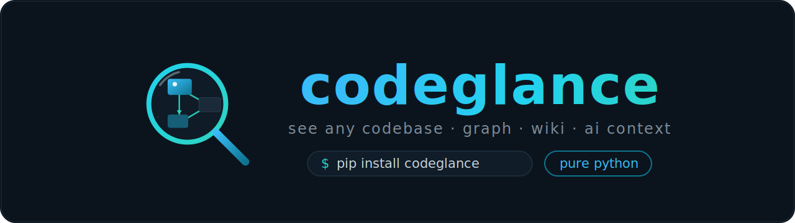

<p align="center">
  
</p>
<p align="center">
  
</p>

A **pure-Python**, `pip`-installable tool that visualizes and documents any codebase — no Node, no server, no hosting.

Point it at a codebase and it produces **three views of one analysis** — each a **single,
self-contained file** you just open. No Node, no npm, no server, no hosting:

```bash
pip install codeglance

# 1) Interactive knowledge graph (files · functions · classes · dependencies) -> one HTML file
codeglance /path/to/project

# 2) Readable docs/wiki page (getting-started, architecture, per-file reference)
codeglance wiki /path/to/project

# 3) Compact, dependency-first "codebase map" for AI agents (Markdown to stdout)
codeglance context /path/to/project

# also: re-render an existing graph, or a zero-JavaScript static SVG
codeglance render /path/to/project/.codeglance/knowledge-graph.json -o graph.html
codeglance render knowledge-graph.json --static -o graph.svg.html
```

> The **`context`** output is built for AI agents — it's the read-first hub files, a `file -> file`
> dependency list, and a one-line summary + symbols per file, so an agent understands a repo's
> structure without reading every line. There's a bundled Claude Code skill (`.claude/skills/codebase-map`).

## What makes it different

- **Python only** — `pip install` and go. No Node, npm, Vite, or build step.
- **Single self-contained file** — open the HTML directly (`file://`); no dev server, no hosting.
- **Deterministic by default** — tree-sitter / Python `ast` structural analysis; optional `--llm` enrichment.
- **Portable schema** — a plain `knowledge-graph.json` (`{ version, project, nodes, edges, layers, tour }`).

## Analysis modes (hybrid)

- **Default (deterministic, offline, free):** tree-sitter / Python `ast` structural extraction —
  files, functions, classes, imports, Louvain-detected layers, a heuristic tour.
- **`--llm` (optional):** enrich node summaries, layer names and the guided tour via an LLM API
  (set `ANTHROPIC_API_KEY`). Everything still works without it.

## Visual modes

- **Interactive (default):** a self-contained HTML canvas app —
  **labeled node cards** colored **by type** (with a type badge), **layer container boxes**,
  **directional edge arrows**, a **project-overview** panel, and a rich **node panel** when you
  click a card: the **signature**, the **docstring / leading doc-comment** pulled from the code,
  tags, complexity, typed connections, and the **syntax-highlighted source code with line numbers**
  (the node's own line range highlighted). Plus pan/zoom, search, layer + node-type legends, a
  minimap, **directional curved edges with type labels**, **animated _marching-ants_ flow edges**
  (dashes glide from source → target; toggle with the **≈ Flow** button or `a`), a **path finder**
  (shortest path between any two nodes), a **Filter popup** (by node type & complexity), a
  **Fuzzy / Semantic search** with a ranked results dropdown, a **Focus mode** (isolate a node +
  its 1-hop neighbors), a **Diff overlay** (highlight files changed since the last analysis),
  **export to PNG / SVG / JSON**, **persona tabs** (Overview / Explore / Tour), **zoom
  controls**, a guided tour, and keyboard shortcuts (`/ f p e a d t i x b ?`). It
  opens on an **overview of layer cards** (name, description, complexity, file count) and you
  **click a layer to drill into its files**, with a breadcrumb back to the overview. The header has
  **persona tabs**, a **Files/+Classes/`fn`** detail toggle, **category
  filter buttons** (Code/Config/Docs/Infra/Data/Domain/Knowledge), a **Structural / Domain / Knowledge** view
  toggle, and **inline layer chips**;
  the sidebar has **Info / Files tabs** — a collapsible file explorer with **VS Code-style
  file-type icons** ([vscode-icons](https://github.com/vscode-icons/vscode-icons), MIT, inlined)
  plus the **guided-tour steps**. A **theme picker** (**Dark Ocean** by default, plus Dark Gold /
  Forest / Rose / Light Minimal, 8 accent colors, Serif/Sans/Mono heading font) recolors
  everything — all base colors are CSS variables, so you can also just open the `.html` and tweak
  them. Fully offline.
- **`--static`:** a zero-JavaScript inline-SVG rendering (cards + containers + arrows). A picture,
  but truly no JS.

### Domain view

Toggle **Domain** in the header (or press `d`) for a higher-level **domain map**: each top-level
package / service directory becomes a **domain card** (its classes/types listed as **entities**),
and the imports/calls between domains become **animated flow edges**. It's inferred deterministically
from the project structure — no LLM required — so a microservices repo shows each service and how
they depend on one another. Try `codeglance examples/microservices` then click **Domain**.

### Knowledge view

Toggle **Knowledge** (or press `k`) for a **knowledge graph** of your docs: each markdown file
becomes an **article** card (its headings listed as **topics**), and `[[wikilinks]]` / `[](other.md)`
links between docs become **related / cites** edges — the Obsidian / Karpathy-wiki pattern,
extracted deterministically (no LLM). Try `codeglance examples/wiki` then click **Knowledge**.

## Knowledge graph schema

`{ version, project, nodes[], edges[], layers[], tour[] }` — a plain, self-describing JSON format
you can read, diff, or generate elsewhere.

## Language coverage

Deep symbol extraction (functions, classes, methods, **variables & constants** → `contains` edges)
— **all ~50 work out of the box from a single `pip install`** (tree-sitter ships as a normal pip
wheel; no Node, no build):

- **Python** — stdlib `ast`: functions, classes, methods, **module-level variables/constants, and
  class attributes** (`UPPER_CASE` → constant, otherwise variable).
- **~50 more** via bundled tree-sitter grammars:
  - *Tuned* (precise method/impl handling): JavaScript, TypeScript/TSX, Go, Rust, Java, Ruby,
    PHP, C#, C, C++, Kotlin, Swift, Scala, Lua. Top-level **`var` / `const` / `let` / `static`
    declarations** plus **class fields & properties** are captured as variable/constant nodes
    across these languages (function-local variables are intentionally skipped to keep the graph
    readable). The *generic* classifier also picks up variable/constant/**signal** declarations in
    the other ~30 languages (e.g. VHDL signals, Fortran/Ada variables) where the grammar exposes
    them — so variables work across essentially all languages, not just a few.
  - *Terraform/HCL* — resource / module / variable / output blocks, **plus `depends_on` edges**
    between blocks that reference each other (resource → security group → module → variable).
  - *Generic node-kind classifier* (works across any grammar): VHDL, Verilog, COBOL, Fortran,
    Ada, Pascal, Haskell, OCaml, Erlang, Elixir, Clojure, Elm, Julia, R, Perl, Groovy, Dart,
    Zig, Nim, Crystal, D, Solidity, Objective-C, MATLAB, PowerShell, Tcl, Common Lisp, Scheme,
    Racket, Gleam, Odin, GLSL/HLSL/WGSL, shell — and more.
- **Any other text file** — file-level node with a heuristic summary; import edges where supported.

Yes, including VHDL and COBOL. The generic classifier matches function/type node kinds by name
across arbitrary tree-sitter grammars, so adding a language is usually just a file-extension entry.
Without the extra, non-Python files still appear as file nodes — you just don't get per-symbol
detail.

**Import-graph edges** resolve intra-project dependencies for: Python (`ast`), JS/TS (relative),
Go (go.mod module + packages), Rust (`mod` / `use crate::`), Java (dotted path), C/C++
(`#include "..."`), Ruby (`require_relative`), and PHP (`require`/`include`).

## Incremental updates

Re-running `codeglance .` is cheap: per-file content fingerprints (`.codeglance/fingerprints.json`)
detect what changed. Unchanged files keep their existing summaries (so prior `--llm` enrichment is
preserved for free), and `--llm` only re-summarizes changed/added files. Pass `--full` to force a
complete rebuild.
