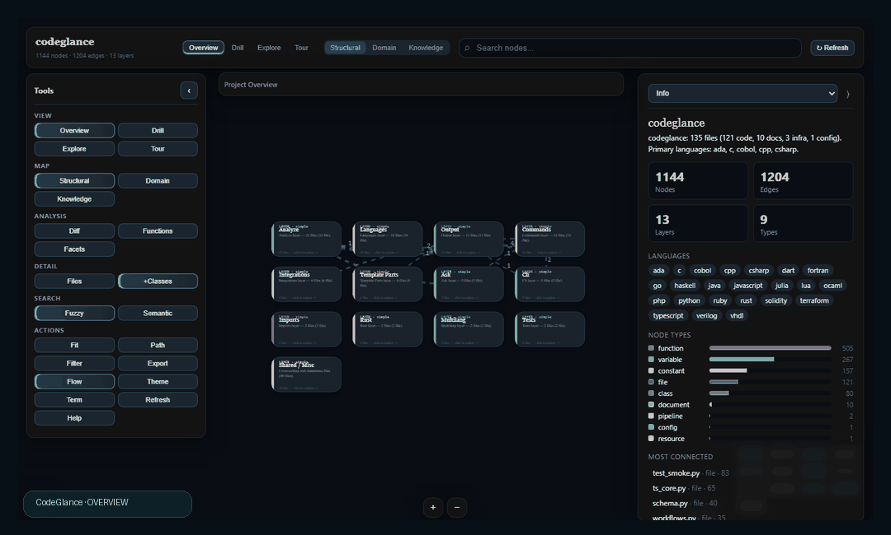
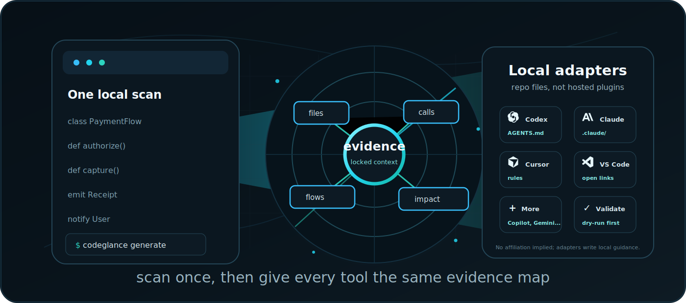
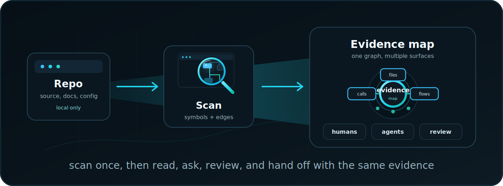
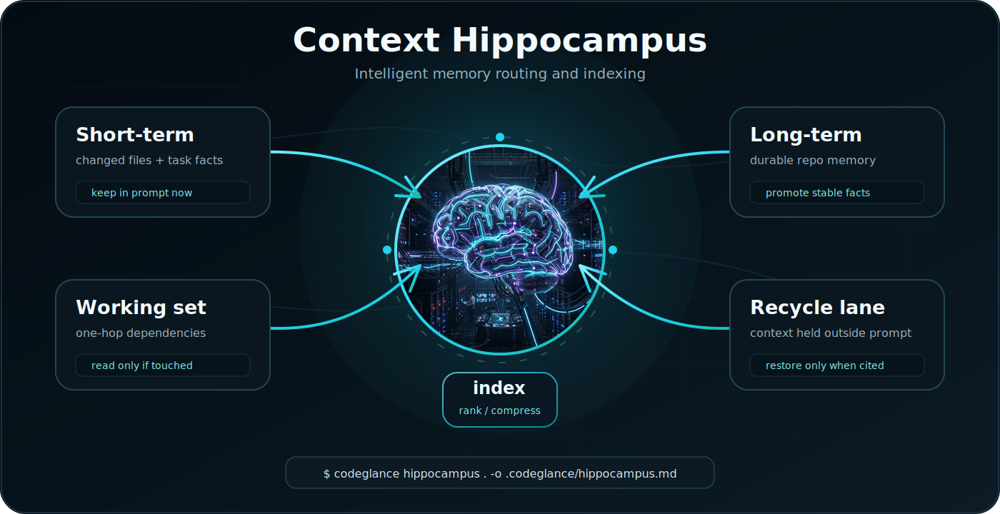
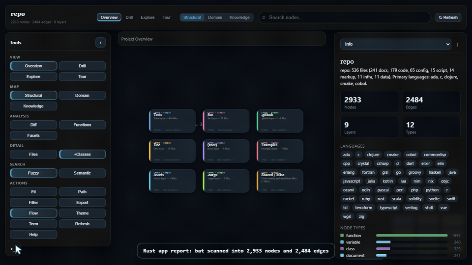

<p align="center">
  
</p>
<p align="center">
  
</p>
<p align="center">
  
  
  
  
  
</p>

<p align="center">
  
</p>

`codeglance` turns a repository into a visual map, a readable wiki, and compact AI context files.
By default, it runs locally, writes deterministic artifacts, and gives humans and coding agents the
same evidence before anyone starts editing source.

**Map first. Source last.**

```bash
pip install codeglance
codeglance init
codeglance generate . --out .codeglance/outputs --profile all
codeglance serve . --dir .codeglance/outputs --watch
```

Default runs use no Node, no npm, and no hosted service. Python CLI in, static files out.

## Why

New repo, inherited repo, huge repo: the failure mode is usually the same. You open files too early,
miss the dependency shape, and hand an AI agent a pile of source with no reading order.

Codeglance gives you a repo memory layer:

| Need | Codeglance output |
| --- | --- |
| See the system shape | Interactive `glance.html` graph with layers, domains, dependencies, search, focus, paths, and export. |
| Read the project like docs | Generated `wiki.html` with overview, architecture, domains, file reference, and reading order. |
| Give agents compact context | `llms.txt`, `agent.md`, and `knowledge-graph.toon` for low-token handoffs. |
| Plan a change | `impact.md`, `review.md`, changed-file overlays, and dependency hotspots. |
| Browse locally | `codeglance serve` hosts generated artifacts; bind `--host 0.0.0.0` for phone access on the same network. |
| Bring tools along | Local guidance files for agent/editor workflows. No plugin install, network call, or hosted runtime required. |

## How It Works

<p align="center">
  
</p>

## Hippocampus Context

<p align="center">
  
</p>

`codeglance hippocampus` turns the graph into a memory budget for long agent sessions. It keeps
changed files and task facts in short-term memory, promotes reusable architecture into long-term
memory, and moves low-signal files into a recycle lane until the graph pulls them back.

| Lane | What it saves |
| --- | --- |
| Short-term | The few files and facts that must stay in the prompt right now. |
| Working set | One-hop dependencies that explain the task without reading the whole repo. |
| Long-term | Stable architecture facts that can be reused across sessions. |
| Recycle lane | Low-signal context kept out of the prompt until evidence cites it again. |

## Quick Start

Generate the legacy single-graph view:

```bash
codeglance init
codeglance .
```

That writes:

```text
.codeglance/knowledge-graph.json
.codeglance/knowledge-graph.html
.codeglance/meta.json
```

That path is useful for a quick one-off graph. For the current full local dashboard, generate the
output bundle:

```bash
codeglance generate . --out .codeglance/outputs --profile all
codeglance serve . --dir .codeglance/outputs --host 0.0.0.0 --watch
```

Open the printed URL on your desktop or phone on the same Wi-Fi. `--watch` regenerates the bundle
when files change and quietly marks the `glance.html` Refresh button when newer output is available.

## Command Map

| Command | Use it when you want to |
| --- | --- |
| `codeglance .` | Analyze a project and write the primary interactive graph. |
| `codeglance wiki . -o .codeglance/wiki.html` | Generate a readable architecture/wiki document. |
| `codeglance context . --mode agent -o AGENTS.md` | Create a small agent handoff file. |
| `codeglance context . --mode full -o .codeglance/context.md` | Create fuller repo context with dependencies and symbols. |
| `codeglance explain src/app.py` | Explain one file or symbol. |
| `codeglance ask "Where should I start?" .` | Ask a repo question and get cited graph evidence. |
| `codeglance processes .` | Generate a domain/process map from the analyzed graph. |
| `codeglance hippocampus .` | Generate a context memory budget with short-term, working, long-term, and recycle lanes. |
| `codeglance onboard .` | Generate a first-day walkthrough. |
| `codeglance impact .` | Build a changed-file impact report. |
| `codeglance review .` | Check graph/output quality before sharing. |
| `codeglance generate . --profile all` | Produce the full local output folder from one analysis pass. |
| `codeglance serve . --watch` | Browse outputs locally and refresh as files change. |

## Output Profiles

| Profile | Best for | Includes |
| --- | --- | --- |
| `minimal` | Fast default handoff | `index.html`, `llms.txt`, `glance.html`, `agent.md`, schema, TOON, graph JSON, metadata. |
| `human` | People reviewing a repo | Visual graph, wiki, process map, hippocampus context, onboarding, impact docs, review docs, metadata. |
| `agent` | Coding-agent context | Compact agent context, process map, hippocampus memory budget, onboarding, impact docs, review docs, graph data. |
| `all` | Full local bundle | Every generated artifact. |

Frequently generated files:

| File | Profile | Audience | Purpose |
| --- | --- | --- | --- |
| `index.html` | `minimal`, `human`, `all` | human | Clickable output-folder landing page. |
| `glance.html` | `minimal`, `human`, `all` | human | Interactive visual codebase map. |
| `llms.txt` | `minimal`, `human`, `agent`, `all` | agent | Small read-first entrypoint with artifact order and usage rules. |
| `agent.md` | `minimal`, `agent`, `all` | agent | Compact, low-token repo handoff. |
| `knowledge-graph.toon` | `minimal`, `agent`, `all` | agent | Compact graph context for prompts. |
| `knowledge-graph.json` | `minimal`, `human`, `agent`, `all` | tool | Canonical structured graph for parsing and re-rendering. |
| `llm-context.schema.json` | `minimal`, `agent`, `all` | agent/tool | Machine-readable contract for generated artifacts. |
| `meta.json` | `minimal`, `human`, `agent`, `all` | human/tool | Version, commit, analyzed file count, and analysis metadata. |

Human, agent, and full profiles add the heavier review artifacts:

| File | Profile | Purpose |
| --- | --- | --- |
| `wiki.html` | `human`, `all` | Readable project wiki. |
| `processes.md` | `human`, `agent`, `all` | Domain/process map inferred from the graph. |
| `processes.json` | `agent`, `all` | Structured process map for tools. |
| `context.md` | `all` | Fuller markdown repo context. |
| `graph.static.html` | `all` | Zero-JavaScript static graph render. |
| `hippocampus.md` | `human`, `agent`, `all` | Context memory budget for long agent sessions. |
| `onboarding.md` | `human`, `agent`, `all` | First-day reading path. |
| `impact.md` | `human`, `agent`, `all` | Changed-file impact report. |
| `review.md` | `human`, `agent`, `all` | Share-readiness and graph quality checks. |

## Interactive Graph

The default HTML graph is a self-contained canvas app. It opens directly from disk or through
`codeglance serve`.

| Area | Built in |
| --- | --- |
| Navigation | Zoom, pan, focus mode, path finding, guided tour, search, filters. |
| Views | Structural graph, domain/process view, knowledge view, file tree. |
| Inspector | Source snippets, highlighted symbols, dependencies, used-by links, editor links. |
| Output | Export PNG, SVG, or JSON. |
| Devices | Desktop layout plus mobile bottom sheets, safe-area handling, tap/pan/pinch gestures. |
| Local workflow | Watch mode marks refresh quietly; no forced reloads or pop-up banners. |

Large repositories can produce large self-contained HTML because the graph data is embedded into
the file. For browser-friendly output, keep generated, vendored, and bulky public assets out of the
scan with `.gitignore` or `.codeglance/.codeglanceignore`.

## Agent and Editor Adapters

Codeglance writes repo-local guidance files that point tools to the same generated artifacts. It
does not install official plugins, publish marketplace packages, call tool APIs, or imply affiliation.
Project credit uses non-personal metadata: CodeGlance Contributor, with AI assistance from Claude
and Codex.

| Target | Generated guidance |
| --- | --- |
| Codex | `AGENTS.md`, `.agents/skills/codeglance/SKILL.md` |
| Claude Code | `.claude/skills/codeglance/SKILL.md`, `.claude/commands/codeglance.md` |
| Cursor | `.cursor/rules/codeglance.mdc` |
| Windsurf | `.windsurf/rules/codeglance.md` |
| GitHub Copilot | `.github/copilot-instructions.md` |
| Gemini CLI | `GEMINI.md` |
| Cline | `.clinerules/codeglance.md` |
| Roo Code | `.roo/rules/codeglance.md` |
| Aider | `.aider/codeglance.md` |
| Continue | `.continue/rules/codeglance.md` |
| Augment Code | `.augment-guidelines` |
| Zed | `.rules` |

```bash
codeglance init --agents default
codeglance init --agents all --dry-run
codeglance init --agents codex,cursor,copilot --marketplace-manifests
codeglance init --list-agents

codeglance agents list
codeglance agents plan . --platform codex,cursor --marketplace-manifests
codeglance agents install . --platform cursor --dry-run
codeglance agents validate . --platform codex,cursor
```

Optional marketplace manifests are local JSON descriptors under `.codeglance/marketplace/`; they are
not published or uploaded. No affiliation, endorsement, or partnership is implied with any named
third-party tool.

## Analysis

The default path is deterministic and offline:

| Capability | How |
| --- | --- |
| Python symbols/imports | Standard-library `ast`. |
| Other languages | Bundled tree-sitter grammars through `tree-sitter-language-pack`. |
| Dependencies | Import/reference resolution where local resolution is available. |
| Layers/domains | Inferred from graph structure and path conventions. |
| Summaries/tours | Deterministic fallbacks, with optional LLM enrichment. |
| Incremental runs | `.codeglance/fingerprints.json` keeps unchanged file summaries and marks changed files. |
| Ignore rules | Built-in defaults plus `.gitignore` and `.codeglance/.codeglanceignore`. |

Optional LLM enrichment:

```bash
ANTHROPIC_API_KEY=... codeglance . --llm
```

The package works without an API key.

## Language Coverage

Python is first-class. Tree-sitter coverage adds broad symbol extraction across common, systems, and
older languages:

| Family | Examples |
| --- | --- |
| Web/app | JavaScript, TypeScript/TSX, PHP, Ruby, Dart |
| Backend/systems | Go, Rust, Java, C#, C, C++, Kotlin, Swift, Scala |
| Infrastructure | Terraform/HCL resources, modules, variables, outputs, dependency references |
| Data/ops | PowerShell, shell, Lua, Julia |
| Legacy/specialized | VHDL, Verilog, COBOL, Fortran, Ada, Haskell, OCaml, Erlang, Elixir, Clojure, Common Lisp, Scheme, Racket, Gleam |

Recognized docs, config, data, and source files appear as file-level nodes with summaries. Unknown
extensions and very large files are skipped by the scanner.

## Python API

```python
from codeglance.api import analyze_project, generate_bundle, render_html
from codeglance.models import KnowledgeGraph

graph: KnowledgeGraph = analyze_project(".")
html = render_html(graph, ".")
generate_bundle(".", ".codeglance/outputs")
```

The older `codeglance.schema` imports still work, but new integrations should prefer
`codeglance.models` and `codeglance.api`.

## Schema

The graph is plain JSON:

```json
{
  "version": "1.0.0",
  "project": {},
  "nodes": [],
  "edges": [],
  "layers": [],
  "tour": []
}
```

You can diff it, inspect it, or render it again:

```bash
codeglance render .codeglance/knowledge-graph.json -o graph.html
codeglance render .codeglance/knowledge-graph.json --static -o graph.static.html
```

## Project Structure

```text
codeglance/
├── brand/                  # banner, logo, favicon, README visuals, social-card SVGs
├── docs/                   # structure, agent-context, integrations, release notes
├── src/codeglance/
│   ├── ask/                # graph-evidence retrieval for repo questions
│   ├── analyze/            # scanners, language registry, symbol extraction, layers, tours
│   ├── cli/                # console entrypoint and argparse parser
│   ├── commands/           # CLI command handlers
│   ├── integrations/       # repo-local agent/editor guidance files
│   ├── models/             # public model facade: KnowledgeGraph, Node, Edge, Layer
│   ├── output/             # generated bundles, llms.txt, TOON, schema, index
│   ├── processes/          # domain/process map extraction
│   ├── render/             # interactive HTML, static HTML, wiki, and agent context renderers
│   ├── services/           # reusable workflows used by API and CLI
│   ├── api.py              # public Python SDK surface
│   ├── graph.py            # analysis orchestration
│   ├── schema.py           # canonical graph dataclasses and JSON schema behavior
│   ├── scan.py             # file discovery, language/framework detection
│   └── serve.py            # local output browser
├── tests/
├── pyproject.toml
└── README.md
```

## Documentation Map

| File | Purpose |
| --- | --- |
| [`docs/STRUCTURE.md`](docs/STRUCTURE.md) | Package layout, module responsibilities, SDK imports, generated output layout. |
| [`docs/AGENT_CONTEXT.md`](docs/AGENT_CONTEXT.md) | Agent reading protocol and generated context strategy. |
| [`docs/GLANCE_WALKTHROUGH.md`](docs/GLANCE_WALKTHROUGH.md) | Walkthrough for `glance.html`, generated files, mobile behavior, screenshots, and review flow. |
| [`docs/INTEGRATIONS.md`](docs/INTEGRATIONS.md) | Agent/editor matrix, safety rules, generated files, validation behavior. |
| [`docs/PUBLISHING.md`](docs/PUBLISHING.md) | GitHub Actions and PyPI Trusted Publishing release flow. |

## Status

Current package version: `0.0.3`.

Before publishing a PyPI release, update the version in `pyproject.toml`,
`src/codeglance/__init__.py`, this README badge, and the brand badge text, then restore a PyPI badge
after the package page exists. Publishing automation lives in [docs/PUBLISHING.md](docs/PUBLISHING.md).

## Rust Flow Preview

<p align="center">
  
</p>

Static preview: [`brand/codeglance-ui-preview.png`](brand/codeglance-ui-preview.png)
